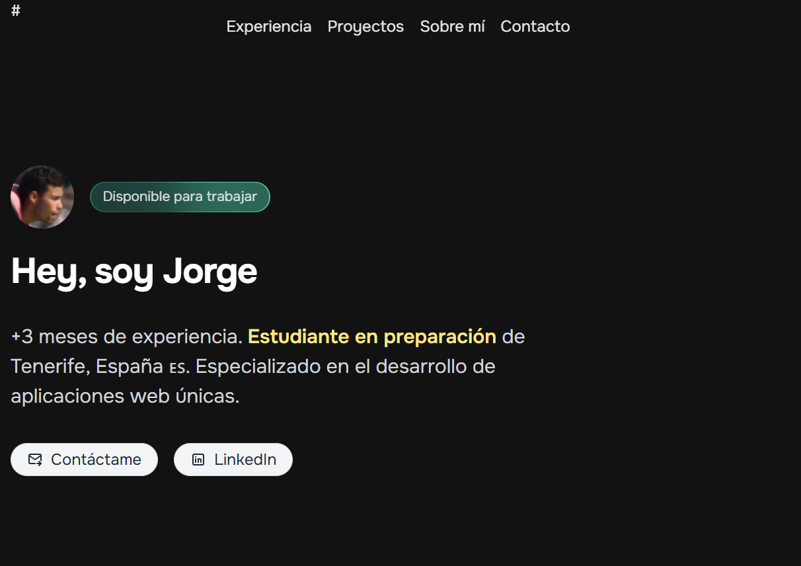

#🌌 Portfolio con Astro

Este repositorio contiene el desarrollo de un portfolio personal construido con Astro, siguiendo buenas prácticas de organización, versionado y despliegue.

##🧩 A. Preparación del repositorio

Se creó una rama base específica para la práctica.

A partir de esta rama, el trabajo se organizó en ramas temáticas según el ámbito abordado (maquetación, componentes, enrutado, transiciones o despliegue).

Cada cambio quedó registrado en commits claros y concisos, redactados en modo imperativo para mantener un historial fácil de seguir.

###🚀 B. Inicio del proyecto Astro

El proyecto se inició desde cero utilizando la plantilla vacía de Astro.

Se instalaron todas las dependencias necesarias y se configuró el entorno de desarrollo para trabajar de forma local.

Alternativamente, se documenta que se podría haber clonado una plantilla existente y adaptarla según las necesidades, dejando constancia de los cambios mediante commits.

####📄 C. Páginas y navegación

Se crearon páginas necesarias para la navegación del portfolio.

Se incluyó una página 404 para gestionar rutas inexistentes de manera elegante.

La navegación entre páginas fue implementada para permitir un recorrido fluido por el sitio.

#####🧱 D. Componentes reutilizables

Se desarrollaron componentes reutilizables que reciben propiedades mediante Astro.props.

Se utilizó la reutilización de componentes en más de un lugar del proyecto para evitar duplicación de código y facilitar la consistencia del diseño.

######🖼️ E. Imágenes optimizadas

Las imágenes se añadieron utilizando los componentes nativos de Astro (<Image> o <Picture>) para asegurar optimización y buen rendimiento en distintos dispositivos.

#######✨ F. Experiencia de navegación

Se implementaron View Transitions para suavizar los cambios entre vistas.

Se habilitó el prefetch de enlaces en los elementos clave para mejorar la velocidad percibida de navegación.

########🔍 G. SEO básico

Se creó un componente de cabecera reutilizable que recibe title y description como propiedades.

Este componente se incluyó en todas las páginas para mejorar el SEO básico del sitio.

###########🌐 H. Despliegue

Se generó la build de producción del proyecto.

Se desplegó el sitio en GitHub Pages.

Se comprobó que la URL pública funcionaba correctamente y se añadió en la descripción del repositorio remoto.

#############🧾 Licencia

Este proyecto se distribuye bajo la licencia MIT.